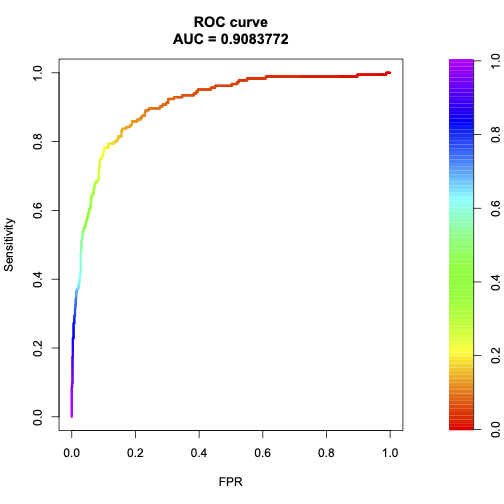
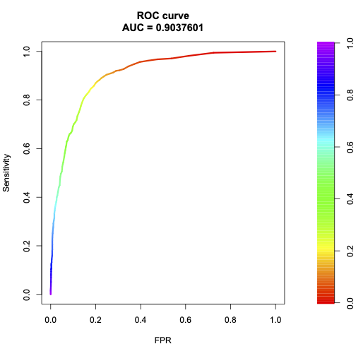

```{r setup, echo=FALSE, results='hide', message=FALSE, warning=FALSE}
knitr::opts_chunk$set(echo=FALSE, message=FALSE, warning=FALSE)

# Uvoz vseh potrebnih knjižnic
source("lib/libraries.r", encoding="UTF-8")
```


## Izbira teme

*** Analiziral bom klube, ki so bili del Premier Lige v letih od 2017-2021. Ker je klubov vsako leto 20, sem se odločil, da bom bolj podrobneje pogledal klub **Mancherster City**. Temo sem izbral zato, ker sem tudi sam igral nogomet in Premier Ligo še vedno spremljam. Gledal bom dejansko ali obstaja kakšna povezava med tem koliko ima vsak klub tujcev, torej igralcev izven Anglije, in številom golov doma oz. delež domačih golov. Prvo bom pogledal iz koliko različnih držav prihajajo in še kakšen delež celotne ekipe predstavljajo tujci, ter nato izračunal deleže domačih golov. Poleg tega pa bom poizkušal prikazati še povezavo s tržno vrednostjo vseh igralcev za posamezen klub.

<br>
<center>


</center>


## Obdelava, uvoz in čiščenje podatkov

```{r uvoz}
source("uvoz/uvoz.r", encoding="UTF-8")
```
Podatke za analizo sem pridobil iz dveh virov oz. spletnih strani:
- [Statistike za igralce PL za sezone od 2017/2018 do 2021/2022](https://footystats.org/england/premier-league), podatke sem dobil za vsako sezono posebej v obliki **csv**.
- [Podatki o tržnih vrednostih klubov PL za sezono 2019/2020](https://www.transfermarkt.com/premier-league/startseite/wettbewerb/GB1/saison_id/2020/plus/1), podatke sem *"scrape-al"* iz spletne strani v obliki **html**.

Podatke sem nato očistil v datoteki `uvoz.r`.

Podatke iz prvega vira sem ločil na tri dele. Prvi del je tabela, ki ima ohranjene vse vrstice. Druga tabela vsebuje le igralce, ki so v Premier Ligi nastopali vseh 5 sezon in pri tem niso v nobeni sezoni med sezono zamenjali kluba. In tretja tabela vsebuje samo klube, ki so bili v Premier Ligi vseh 5 sezon, torej niso izpadli, zato da lahko narišem graf, ki ima časovno komponento.

Podatki iz drugega vira pa so podani samo za sezono *2019/2020* in ta tabela ima sledeče stolpce.Te podatke sem pridobil s pomočjo **Google Chrome Extention-a**, ki sem imenuje `SelectorGadget`.

```{r}
head(PL_drugi_del)
```

***

## Analiza in vizualizacija podatkov

```{r vizualizacija, results='hide'}
source("vizualizacija/vizualizacija.r", encoding="UTF-8")
```

Prvi graf prikazuje število različnih držav iz katerih prihajajo igralci za posamezen klub v sezoni **2019/2020**.
Iz grafa lahko razberemo, da je klub **Manchester City = MCI**, ki ga bom tudi podrobneje analiziral med klubi, ki imajo najmanj mednarodno ekipo.

```{r graf_1, echo=FALSE, fig.align='center'}
graf1
```


Drugi graf prikazuje pa za vsak klub posebej in sezono 2019/2020, delež tujih igralcev, ki jih ima klub glede na vse tuje igralce skupaj.
```{r graf_2, echo=FALSE, fig.align='center'}
graf_2
```

Izpostavljen je seveda **Manchester City**, ki pa sedaj ni med klubi z najmanjšim deležem. Torej iz prvega in drugega grafa skupaj lahko sklepamo, da ima Manchester City relativno veliko tujcev v svoji ekipi, ki pa prihajajo iz manj različnih držav. 

<br>
<center>


</center>

Ker je bil moj cilj gledati, če obstaja kakšna povezava med številom tujcev in številom golov, ki jih posamezen klub da na gostovanju, sem zato narisal naslednji graf, ki prikazuje za vsak klub posebej in za vsako sezono, kolikšen delež golov so dali v gosteh glede na vse gole, ki so jih dali.

```{r graf_3, echo=FALSE, fig.align='center'}
graf_3
```

Iz grafov se vidi, da načeloma ni nobenega pravila oz. vzorca. Vidimo pa lahko, da je Arsenalu v zadnji sezone delež golov v gosteh močno padel.


Na *grafu 4* so predstavljeni deleži tujcev za vsak klub posebej in za vsako sezono. Z rdečo barvo je označen tudi **Manchester City**.
 
```{r graf_4, echo=FALSE, fig.align='center'}
graf_4
```

Iz grafa se vidi, da **Manchester City** načeloma spada v neko povprečje, le v sezoni 2018/2019 je bil njihov delež tujcev najvišji od vseh klubov. Od tiste sezone naprej pa je samo še padal. V oči pade tudi Burnley, ki je klub, ki ima skozi vsa leta najnižji delež in to ne za malo.


Na naslednjem grafu sem se odločil predstaviti obe statistiki, ki sta pomembni, torej delež tujcev v ekipi in delež golov v gosteh za vsak klub in za vse sezone. 
- Velikost krogov prikazuje delež tujcev v klubu. Večja kot je, večji je delež.
- Barva krogov pa prikazuje delež golov v gosteh. Svetlejša kot je modra brava,večji je delež.

```{r graf_5, echo=FALSE, fig.align='center'}
graf_5
```


Naslednji grafi se bodo omejili le na Manchester City. Graf 6 tako prikazuje kakšna sta bila delež domačih golov in golov v gosteh. 

```{r graf_6, echo=FALSE, fig.align='center'}
graf_6
```

Razvidno je, da sta deleža dokaj konstantna, pri čemer je delež domačih golov vedno nekaj na 50%, kar je seveda bilo za pričakovati.


Spodnji graf pa sedaj združi obe pomembni statistiki za klub MCI. Narisana je tudi regresijska premica, ki nam lepo pokaže kakšen je trend.

```{r graf_7, echo=FALSE, fig.align='center'}
graf_7
```

Iz grafa opazimo, da hipotezo, da sta ti dve statistiki korelirani, težko potrdimo, čeprav oba deleža s časom padata, se delež tujcev spreminja hitreje kot delež golov v gosteh.


Naslednji graf prikazuje porazdelitev golov v gosteh, torej število igralcev, ki dosežejo 0 golov , 1 gol itd. Vzel sem samo igralce, ki so igrali več kot  1000 minut, ker če igralec ne igra tudi ne more zadeti gola. Barve na grafu pa ločijo pozicije na katerih igralci igrajo. Kot lahko vidimo iz grafa so seveda napadalci tisti, ki zadanejo največ golov potem za njimi sledijo vezisti.

```{r graf_8, echo=FALSE, fig.align='center'}
graf_8
```


Deveti graf pa sedaj prikazuje povezavo med povprečno tržno vrednostjo in povprečno starostjo. Pričakovano je, da višja kot je povprečna starost nižja bo povprečna tržna vrednost, saj igralcem vrednost z leti seveda pada. Opazimo tudi, da je **MCI** na vrhu kar se tiče tržne vrednosti in pri tem ima tudi dokaj mlado ekipo.

```{r graf_9, echo=FALSE, fig.align='center'}
graf_9
```


Na zemeljevidu Evrope sem se potem še odločil prikazati, kakšen je delež kartonov, ki jih dobi vsaka država. Lepo lahko vidimo, da imata državi Severna Makedonija in Srbija ene najvišjih deležev.

```{r zemljevid_kartonov, echo=FALSE, fig.align='center'}
zemljevid_kartonov
```


***


## Napredna analiza podatkov

```{r analiza}
source("analiza/analiza.r", encoding="UTF-8")
```

### Clustering
Pri napredni analizi podatkov pa je bil cilj pogledati kako dobro lahko ločimo med igralci, ki igrajo na različih pozicijah, glede na dve spremenljvki *goli skupno* in *rumeni kartoni*, za sezono **2019/2020** in samo za igralce, ki so igrali več kot 1000 minut, ker seveda, če igralec ne igra ne more dati gola niti dobiti rumenega kartona.

V mojem primeru že vemo, da so igralci razdeljeni na 4 skupine, ki so:
- napadalci = N
- branilci = B
- vezisti = V
- golmani = G

Iz prvega grafa lahko vidimo torej, da glede na število golov in število rumenih kartonov lahko le deloma ločimo igralce med seboj, saj jih je velika večina v območju [0,5]x[0,5]. Moja hipoteza pa je, da območje, kjer imajo igralci veliko golov in malo rumenih kartonov (območje desno spodaj) pripada večinoma oz. povsem napadalcem.

```{r graf_clus_1, echo=FALSE, fig.align='center'}
graf_clus_1
```

Potem sem narisal dendogram, ki pa ni najbolj berljiv, saj imamo veliko število igralcev.

Na spodnjem grafu pa lahko lepše vidimo kakšna je višina združevanja glede na število skupin. Na grafu se tudi lepo vidi, da je **k = 4** tudi koleno, kar je natanko toliko kot imamo različnih pozicij.

```{r graf_clus_2, echo=FALSE, fig.align='center'}
graf_clus_2
```


Na koncu sem narisal še diagram, ki sicer potrjuje mojo hipotezo, ampak hkrati tudi prikazuje, da je veliko napadalcev, ki pade tudi v območje spodaj levo in celo levo zgoraj.


```{r diagram_clsu_4, echo=FALSE, fig.align='center'}
diagram_clus_4
```


To, da se te štiri skupine  močno mešajo med seboj pa je slabo za napovedovanje ali je dani igralec napadalec ali ne s pomočjo strojnega učenja, kar pa je naslednji del moje analize.


### Strojno učenje


Kot sem omenil, bom napovedoval ali je posamezen igralec napadalec ali ne. To je seveda **klasifikacijski** problem. Za napovedne spremenljivke pa nisem vzel le *število golov* in *število rumenih kartonov*, ampak dejansko vse numerične spremenljivke, razen datuma rojstva.


Za primerjavo sem si izbral dva modela. Prvi je model, ki uporablja **metodo podpornih vektorjev = SVM** in drugi je model, ki uporablja **metodo naključnih gozdov = RF**.


Klasifikiacije sem se torej lotil tako, da se vse vrednosti, kjer ima stolpec *pozicija* vrednost *Forward* spremenil v *Y* in povsod, kjer nima te vrednsti spremenil v *N*. To je moja ciljna spremenljivka, zato sem tudi stolpec **pozicija** preimenoval v **ciljna**. Podatke sem nato s pomočjo `createDataPartition` razdelil na **učno** in **testno** množico. 

Potem sem z **učno** množico natreniral (z 10-kratno prečno validacijo) oba modela in potem na **testni** množici preveril in dobil naslednje metrike:
- Natančnost modela SVM: **90.97 %**
- Natančnost modela RF: **89.84 %**

Na podlagi te metrike bi torej izbral **model SVM**.

Ker pa imamo klasifikacijski problem sem pogledal še metriko **AUC**, kar je dejansko *Area Under Curve* pod krivuljo *ROC* in bližje vrednosti 1 je tem bolje.
Za **model SVM** sem dobil spodnji graf:
<br>
<center>


</center>

Za **model RF** pa:
<br>
<center>



</center>

Torej bi tudi na podali te metrike izbral **metodo podpornih vektorjev**.


### Shiny 
```{r shiny}
#shinyAppDir("shiny", options=list(width="100%", height=600))
```

Naredil sem tudi aplikacijo Shiny, ki prikazuje število zadetih in zgrešenih penalov.
